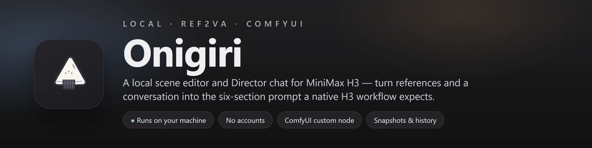
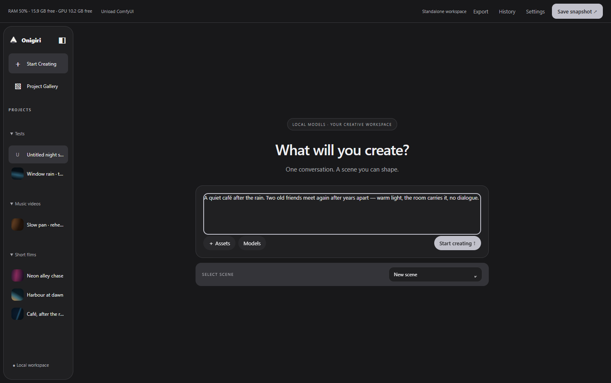
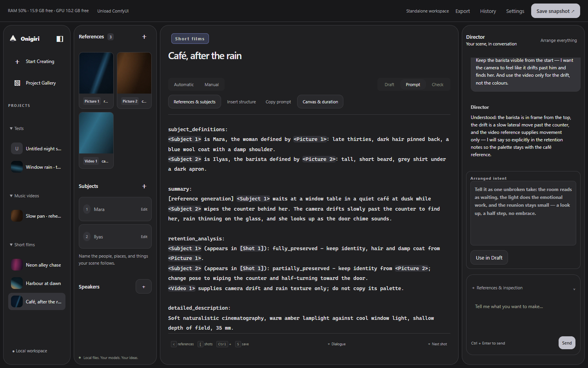
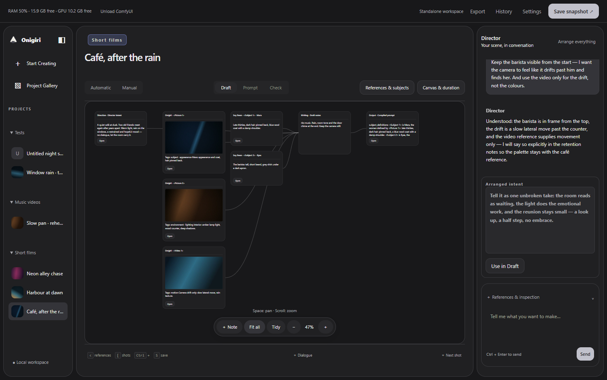
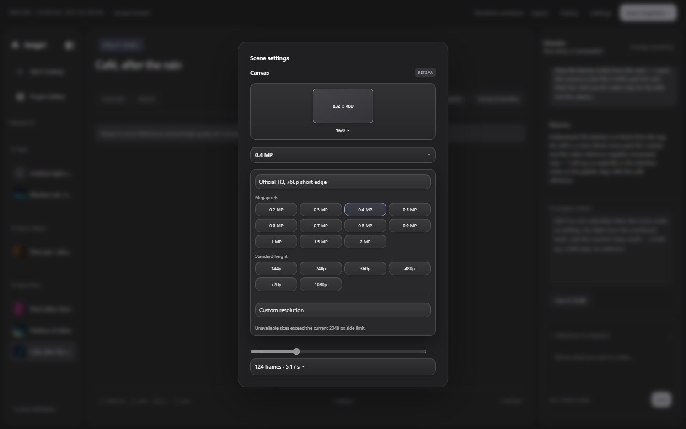
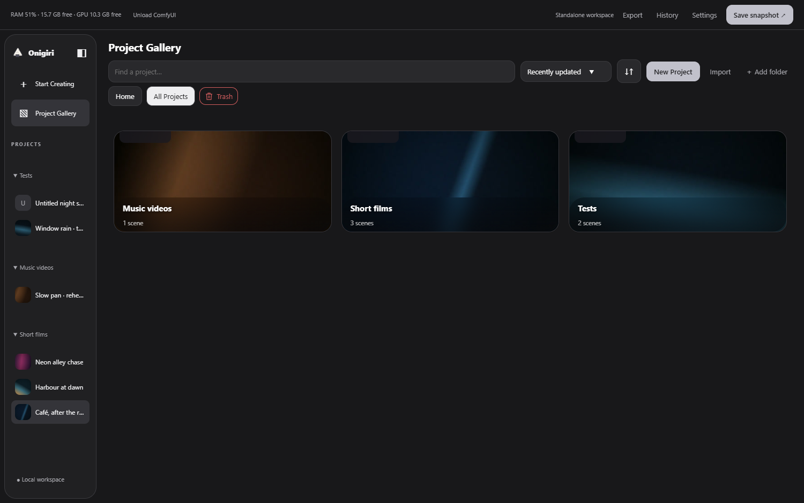
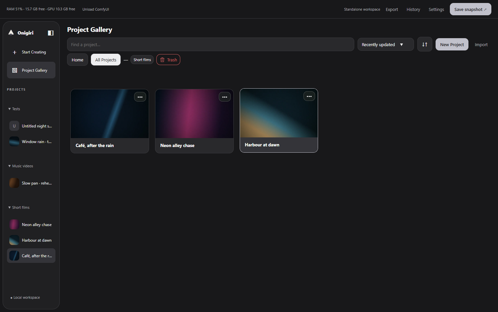
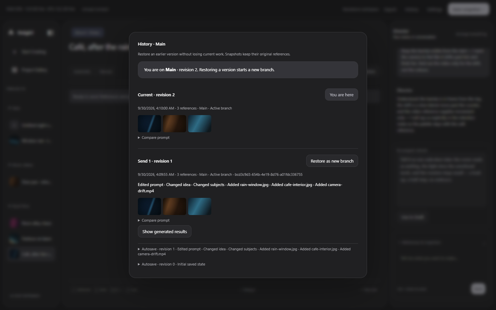
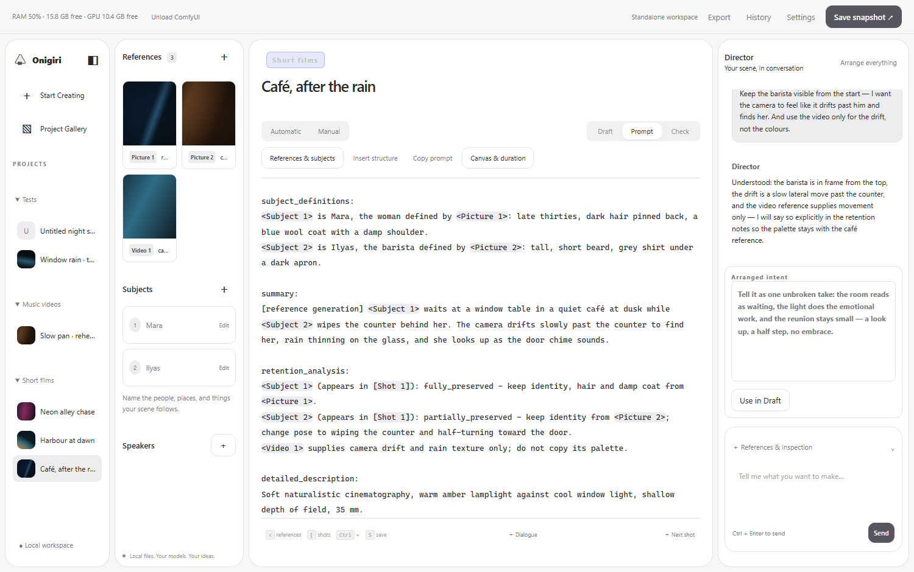
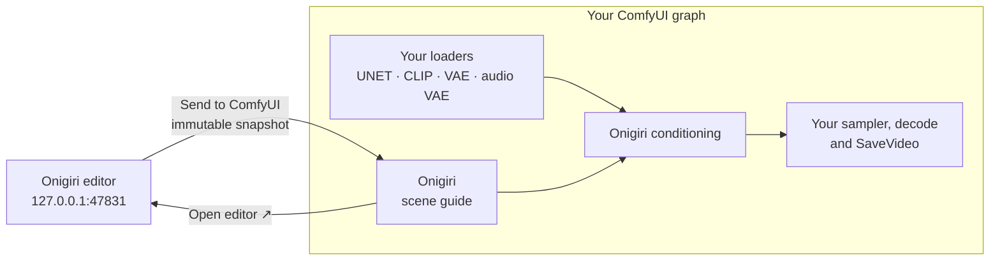

<div align="center">

**Turn references and a conversation into the six-section prompt that native MiniMax H3 Ref2VA expects — then send it straight to your ComfyUI graph.**


</div>

Onigiri is two halves of one tool: a **ComfyUI custom node** that carries a scene into native H3 conditioning, and a **local editor** that builds that scene with you. Everything runs on your machine — plain Node.js, no accounts, no hosted service, no database. Your scenes, references, conversation history and snapshots stay in your own folder, and model weights are never part of this repository.

---

## What it does

| Feature | What it gives you |
| --- | --- |
| **Director chat** | Describe the scene in your own words and talk it through with a local model. It asks about ambiguous references instead of guessing, and older turns are compacted so long conversations stay coherent. |
| **References that mean something** | Drop images, video or audio. A picture can supply a subject's appearance while a video supplies motion; video is sampled into frames for inspection, and trims can be cut, sequenced and retimed. |
| **A prompt you can read** | Everything is assembled into the six native H3 sections — `subject_definitions`, `summary`, `retention_analysis`, `detailed_description`, `overall_soundscape`, `non_diegetic_music` — with live checks for missing references, dialogue syntax and canvas contracts. |
| **One-click send** | **Send to ComfyUI** writes an immutable snapshot and hands it to the **Onigiri** node in your graph. Keep your own loaders, samplers and decoders; Onigiri only replaces the conditioning. |
| **Snapshots and history** | Restoring an earlier version creates a branch instead of overwriting work, and sent snapshots keep the references they were sent with. |

## Quick start (Windows)

Start with **ComfyUI with native MiniMax H3 support**. Onigiri installs its node and Director runtime, not ComfyUI or H3 rendering weights.

1. Install [Git for Windows](https://git-scm.com/downloads/win), then open PowerShell:

   ```powershell
   git clone https://github.com/Marauberry/onigiri.git
   cd onigiri
   powershell -NoProfile -ExecutionPolicy Bypass -File scripts/bootstrap.ps1 -ComfyRoot "D:\ComfyUI"
   ```

   No Git? Use **Code > Download ZIP**, extract to a permanent folder, open PowerShell there and run the last command. Replace `D:\ComfyUI` with the folder containing `main.py`, `custom_nodes` and `comfy_extras`. For portable installs this is usually `ComfyUI_windows_portable\ComfyUI`, not its parent. Keep the Onigiri folder in place: the node launches the editor from it.
2. Setup installs missing Node.js/FFmpeg and asks for **NVIDIA CUDA**, **Vulkan (AMD/Intel)** or **CPU** for the Director. Installer prompts may appear. For unattended setup append `-Backend cuda-12.4`, `-Backend vulkan` or `-Backend cpu`. Existing runtime settings are kept unless explicitly changed.
3. Choose a model route:
   - **Existing model:** open **Start Onigiri.cmd > Settings** and select the folder containing your Bonsai GGUF and matching `mmproj`.
   - **Download:** run `powershell -ExecutionPolicy Bypass -File scripts/download-model.ps1 -ModelDirectory "D:\Models\Bonsai" -Variant official`, then select that folder in Settings. Use `-Variant abliterated` for the alternative weights. Allow **7.84 GB** for these files plus additional disk space for the runtime and H3 models.
4. Restart ComfyUI and load [Onigiri Starter.json](workflows/Onigiri%20Starter.json). Select your H3 model, text encoder, video VAE and audio VAE in the loaders. **Bonsai powers the Director; H3 weights render the video. They are separate downloads.**
5. In the Onigiri node: **Open editor > create a scene > Send to ComfyUI > queue**. The starter has no snapshot until you send a scene.

No `npm install` or additional Python requirements are needed for Onigiri itself. The starter requires only native ComfyUI nodes and Onigiri. CPU support applies to the Director; H3 rendering has separate hardware requirements.

### Update an existing installation

Close Onigiri and stop ComfyUI. From your original checkout:

```powershell
git pull --ff-only
powershell -NoProfile -ExecutionPolicy Bypass -File scripts/bootstrap.ps1 -ComfyRoot "D:\ComfyUI"
```

Restart ComfyUI afterward. Setup updates shipped node files and preserves local configuration and projects. For ZIP installs, extract the updated version over the same app folder and rerun bootstrap. Keep `config.local.json`, `data/`, `runtime/` and your models; do not delete the app folder to update it.

## Screenshots

### Start Creating

One composer, your whole idea. Files dropped here wait as pending references until you press **Start creating**, so nothing is written to a scene until you mean it.



### The scene, in conversation

The Director on the right, the work on the left: references and subjects, the compiled prompt, and the checks that stand between you and a queue.



### Draft board

An arrangeable board of intent, references, subjects, notes and the compiled prompt. Drag cards, add notes, or press **Fit all** — the arrangement belongs to the scene.



### Canvas and duration

Official H3 768p short edge, megapixel presets, standard heights through 1080p, or an exact custom size on the 32-pixel grid — with duration in frames and seconds.



### Project gallery

Folders with covers, sorting, search, multi-select and batch actions. Trash is a real grid you can restore from.





### History

Every save is a revision, every send is a snapshot. Restoring an earlier version starts a named branch, and the dialog stays open so you can see where you are.



### Light and dark

The whole editor follows the system theme, or you can pin one.



> The screenshots come from a demo workspace built for this page — its reference plates are abstract lighting gradients, not your media.

## Requirements

| Requirement | Notes |
| --- | --- |
| OS | Windows (the setup scripts are PowerShell) |
| Node.js | 22 or newer — there are no npm dependencies to install |
| FFmpeg | `ffmpeg` and `ffprobe` on `PATH`, or a path you provide |
| ComfyUI | a version with **native MiniMax H3 support** (`comfy_extras/nodes_minimax_h3.py`) |
| Model | a Bonsai 2 Q2/PQ2 GGUF and its matching `mmproj` projector |
| GPU | optional — the runtime ships as CUDA 12.4, CPU or Vulkan |

## Setup

### 1. The ComfyUI custom node

The node is the reason the app exists, so start here. From a clone of this repository:

```powershell
git clone https://github.com/Marauberry/onigiri.git
cd onigiri
powershell -ExecutionPolicy Bypass -File scripts/bootstrap.ps1 -ComfyRoot "D:\ComfyUI"
```

`bootstrap.ps1` is the short path: it installs missing Node.js and FFmpeg through Windows Package Manager, sets up the pinned llama.cpp runtime, and copies the custom node into your ComfyUI. Installer prompts may appear. Then **restart ComfyUI**.

If you would rather do it by hand, or you are on a CPU/Vulkan machine:

```powershell
# Node, FFmpeg and the pinned Prism llama.cpp runtime
.\scripts\setup.ps1 -ModelDirectory 'D:\Models\Bonsai' -FfmpegExecutable 'D:\FFmpeg\bin\ffmpeg.exe' -Backend cuda-12.4

# Copy the node into ComfyUI and write its helper_config.json
.\scripts\install-comfy.ps1 -ComfyRoot 'D:\ComfyUI'
```

Use `-Backend cpu` or `-Backend vulkan` for a machine without NVIDIA CUDA, or `-LlamaDirectory` to import a compatible Prism build you already have. Working runtime settings are preserved. Downloads come from the [official Prism release](https://github.com/PrismML-Eng/llama.cpp/releases/tag/prism-b10743-adfffbe), not from generic llama.cpp builds that may lack PQ2 support, and a failed download never activates a partial install.

Once ComfyUI restarts, add **Onigiri** and **Onigiri conditioning** to your graph. The optional third node, **Onigiri 2nd Pass**, takes a guide and changes only its resolution in MP, outputting the same guide plus width and height for a latent upscaler. A minimal starter and two advanced example graphs ship in [`workflows/`](workflows/README.md).

For a two-pass render, connect the width and height from **Onigiri 2nd Pass** to your upscaler's **Target dimensions** inputs with 32-pixel alignment, then feed the new guide back into Onigiri conditioning. Explicit dimensions keep the node and the upscaler on the same area base — LBH's own megapixel mode uses a different one. Onigiri does not upscale an existing latent: send that latent through your upscaler separately. Timing, reference identity and the sent snapshot are preserved. The native contracts are tested; a full LBH/H3 render has not been queued.

### 2. The editor

Double-click **Start Onigiri.cmd**, or run:

```powershell
npm start
```

If setup has not already run, the launcher downloads the pinned Prism llama.cpp Windows CUDA 12.4 runtime and its CUDA libraries, verifies SHA-256 checksums, and serves the editor at **http://127.0.0.1:47831**. A first-run guide walks through model setup, building a scene and sending it to ComfyUI; reopen it from **Settings → Setup guide**.

### 3. The model

You supply a Bonsai 2 GGUF and a matching projector. Open **Settings**, paste the model folder or the full `.gguf` path, and save — quoted paths are accepted. A single `mmproj` beside the model is picked up automatically; keep just the matching projector in that folder, because an ambiguous match stays text-only.

```powershell
.\scripts\download-model.ps1 -ModelDirectory "D:\Models\Bonsai" -Variant official
```

Use `-Variant abliterated` for the alternative weights, or pass `-DownloadModel official -ModelDirectory "D:\Models\Bonsai"` to bootstrap. Downloads are pinned to known revisions, SHA-256 verified and resumable, and they never replace a conflicting existing file. Expect about **7.84 GB**.

- [Prism Bonsai 2](https://huggingface.co/prism-ml/Ternary-Bonsai-2-27B-gguf)
- [Hikari07jp Bonsai 2 Abliterated](https://huggingface.co/Hikari07jp/Ternary-Bonsai-2-27B-Abliterated-GGUF)

Weights are never included in Git, and neither is your configuration.

## How the node and the editor fit together



The guide node holds the canvas, the timing, the reference list and the prompt. The conditioning node reads the snapshot from disk, turns those references into native H3 conditioning, and passes them to your sampler. ComfyUI core is never modified, and the app never rewrites your saved workflow.

**Open editor → Send to ComfyUI → queue.** Sending creates an immutable snapshot; later Director edits change the working scene, and you send again to use them in the next generation.

## Creating a scene

**Automatic.** Upload references, discuss the intent with the Director, then **Arrange everything** to update the Prompt tab. A picture can supply appearance while a video supplies motion for the same subject, and ambiguous assignments are clarified before arranging.

**Manual.** Use Draft for notes and reference connections. In Prompt, **Insert structure** creates empty headings; drag subjects and references from the asset sidebar and write the content yourself.

Both routes end in the same place: a prompt you have read, on a canvas you chose, that the node can send.

## Workspace details

- **Storage** — `config.local.json`, `data/`, `runtime/` and `test-results/` stay out of Git. The editor binds to loopback only, and you export a portable scene package when you actually want to share media and scenes. Keep the app's project storage available while saved ComfyUI workflows still refer to its local snapshots.
- **Inference** — one local request at a time, then the runtime unloads. Reference observations are reused until the source, trim or model changes, or you press **Reinspect**. There is no parallel inference and no persistent GPU allocation.
- **Inspection** — video inspection samples frames and does not hear audio. Prompt checks validate structure and reference integrity, not rendered quality.
- **Browsing** — projects, references and outputs are browsable in the app; recent ComfyUI generations and the output-folder tree open in a built-in browser, and you can point it at another install's output folder.

## Repository layout

```
server.mjs                     local service: projects, snapshots, assets, bridge
worker.mjs                     llama.cpp jobs: inspection, drafting, arrangement
public/                        the editor UI
comfyui_h3_prompt_helper/      the ComfyUI custom node (Python + web extensions)
workflows/                     starter and advanced MiniMax H3 graphs
scripts/                       bootstrap, setup, install-comfy, model download
tests/                         node test suite and the native H3 contract test
docs/                          the images on this page
```

## Troubleshooting

| Problem | Next step |
| --- | --- |
| Git is missing | Install Git and reopen PowerShell, or use Download ZIP. |
| Winget is unavailable | Install [App Installer](https://apps.microsoft.com/detail/9nblggh4nns1), or install Node.js 22+ and the full FFmpeg package manually. Reopen PowerShell. |
| Node too old / FFprobe missing | Check `node --version`, `ffmpeg -version`, `ffprobe -version`. Upgrade Node to 22+ and install FFmpeg with FFprobe. An older copy earlier on PATH can shadow the new one. |
| ComfyUI folder rejected | Select the inner folder containing `comfy_extras/nodes_minimax_h3.py`; update ComfyUI if this native H3 module is missing. |
| Onigiri nodes missing | Rerun bootstrap with the correct ComfyUI folder, restart ComfyUI and check its terminal for import errors. Cloning this entire repo into `custom_nodes` alone is not supported. |
| Editor does not start | Use `Start Onigiri.cmd`; check `data/server-error.log` and `data/server.log`. Check whether another application occupies port 47831. |
| Director cannot load | Check the model folder in Settings. Rerun bootstrap with an explicit `-Backend cpu`, `vulkan` or `cuda-12.4` to change runtime. Successful runtime validation does not guarantee sufficient RAM/VRAM to load the model. |
| Images not understood | Keep the matching `mmproj` beside the GGUF. An ambiguous projector match remains text-only. |
| Missing models or snapshot | Select installed H3 weights in the workflow loaders, then send a scene from Onigiri before queueing. Bonsai download does not include H3 rendering weights. |

When reporting a bug, include Windows/GPU details, the command and relevant error. Remove private paths, prompts and media from logs before sharing. Clean-machine installation and full rendering still need validation on your hardware.

## Development

```powershell
npm test
```

The native node contract test uses ComfyUI's own virtual environment:

```powershell
& "D:\ComfyUI\.venv\Scripts\python.exe" tests\comfy_contract.py "D:\ComfyUI"
```

Worker changes also need a real model smoke test, and UI changes need a browser check. Do not modify ComfyUI core, and do not commit model weights, local configuration or imported media.

## Limits

Onigiri drafts prompts and validates their structure. It does not promise film-quality results from a text contract, it does not render the video for you, and it does not hear audio. The final render is still your call in ComfyUI. There is no AnimaDex integration — upload reference files directly.

## License

MIT — see [LICENSE](LICENSE). Copyright © 2026 Marauberry.

Publishing under MIT does not give your copyright away: it is you granting everyone permission to use the code. **You may** use, copy, modify, merge, publish, distribute, sublicense and sell it, including inside closed-source projects. **You must** keep the copyright notice and the license text with any copy or substantial portion of the code — that is what "credit" means here: whoever receives the code also receives the author's name and the license. It does not oblige anyone to advertise Onigiri in their UI or README, and nothing grants rights to the Onigiri name or logo.

### Credits and third parties

- The prompt contract in [`instructions/h3.md`](instructions/h3.md) is condensed from the Ref2VA material published by [MiniMax-AI/MiniMax-H3](https://github.com/MiniMax-AI/MiniMax-H3). That source material keeps its own terms; the MIT license above covers this repository's own code.
- The runtime the setup scripts download comes from the [official Prism llama.cpp release](https://github.com/PrismML-Eng/llama.cpp/releases/tag/prism-b10743-adfffbe) under its own terms; [llama.cpp](https://github.com/ggml-org/llama.cpp) is MIT-licensed.
- Model weights are never redistributed here. Bonsai 2 comes from its publishers ([Prism](https://huggingface.co/prism-ml/Ternary-Bonsai-2-27B-gguf), [Hikari07jp](https://huggingface.co/Hikari07jp/Ternary-Bonsai-2-27B-Abliterated-GGUF)) under their own licenses.
- ComfyUI, MiniMax H3 and the model names are used descriptively. No affiliation or endorsement is implied.
